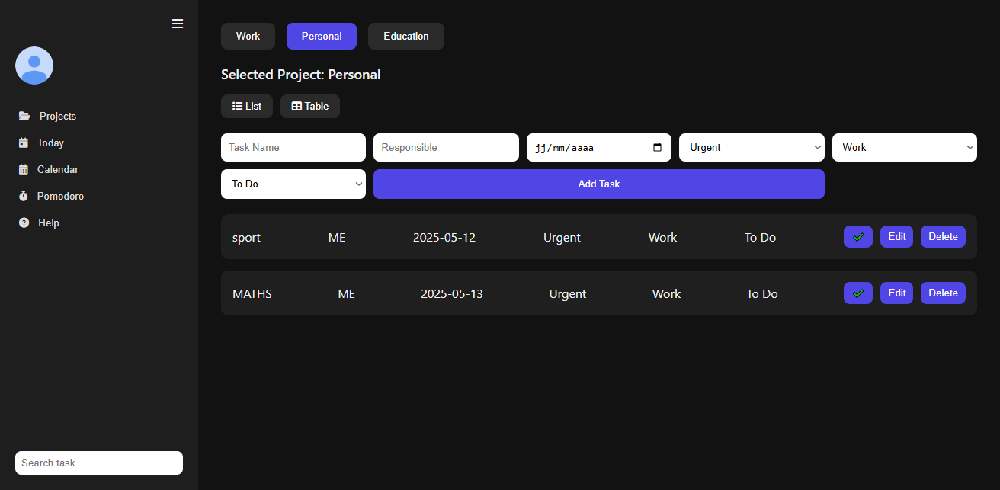
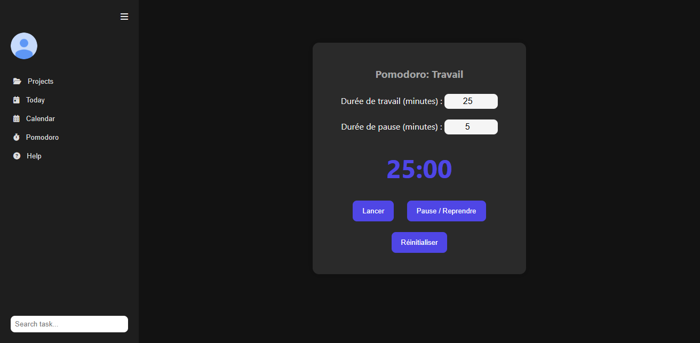
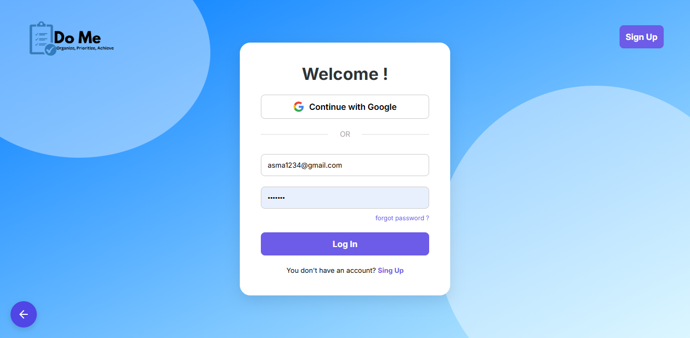

Site Web To-Do List

Une application web simple et intuitive de liste de tâches construite avec HTML et CSS.
Ce projet permet aux utilisateurs d’organiser leurs tâches en les ajoutant, les gérant et les supprimant facilement.

🚀 Fonctionnalités

✅ Ajouter de nouvelles tâches facilement

🗑️ Supprimer les tâches terminées

🎨 Interface simple et épurée

💻 Design responsive (ordinateur & mobile)

📂 Code léger et facile à comprendre

🛠️ Technologies utilisées

HTML5 – structure du site

CSS3 – mise en forme et design responsive

JS - pour plus d'intéractivité

 PHP – pour gérer un stockage côté serveur
## 📸 Aperçu  

 
 
 
 

 
ToDoList/
│── page1.html          # Page principale (accueil)

│── page1.css           # Style de la page principale

│── page1.js            # Script de la page principale

│

│── signup.html         # Page d'inscription

│── signup.css          # Style de la page d'inscription

│── signup.php          # Traitement de l'inscription

│

│── login.html          # Page de connexion

│── login.css           # Style de la page de connexion

│── login.php           # Traitement de la connexion

│
│── domepage.html       # Page de la To-Do List

│── domepage.css        # Style de la To-Do List

│── domepage.php        # Traitement de la To-Do List

│
│── IMGs/               # Dossier contenant les images utilisées

│── todolist_app.sql       # contient la structure et les données de la base.Pour l’utiliser :  
1. Ouvrez **phpMyAdmin**.  
2. Créez une base de données `todolist_db`.  
3. Cliquez sur **Importer** et choisissez `todolist.sql`. 

│── README.md           # Documentation du projet

🌱 Compétences acquises

Grâce à ce projet, j’ai appris à :

Structurer un site web avec HTML

Styliser et améliorer le design avec CSS

Organiser un projet avec plusieurs fichiers

Utiliser Git & GitHub pour publier et gérer mes projets

📌 Améliorations futures

Ajouter une sauvegarde des tâches avec localStorage ou une base de données

Ajouter des catégories et des priorités pour les tâches

Intégrer un mode sombre 🌙

👩‍💻 Auteur

Développé par Asma – Étudiante en Développement Web & Mobile.
🔗 Profil LinkedIn
 www.linkedin.com/in/asma-boulahya

 ✨ N’hésitez pas à forker ce projet, à proposer des améliorations ou à l’utiliser comme point de départ pour vos propres applications To-Do List !

